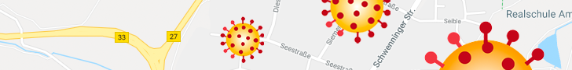
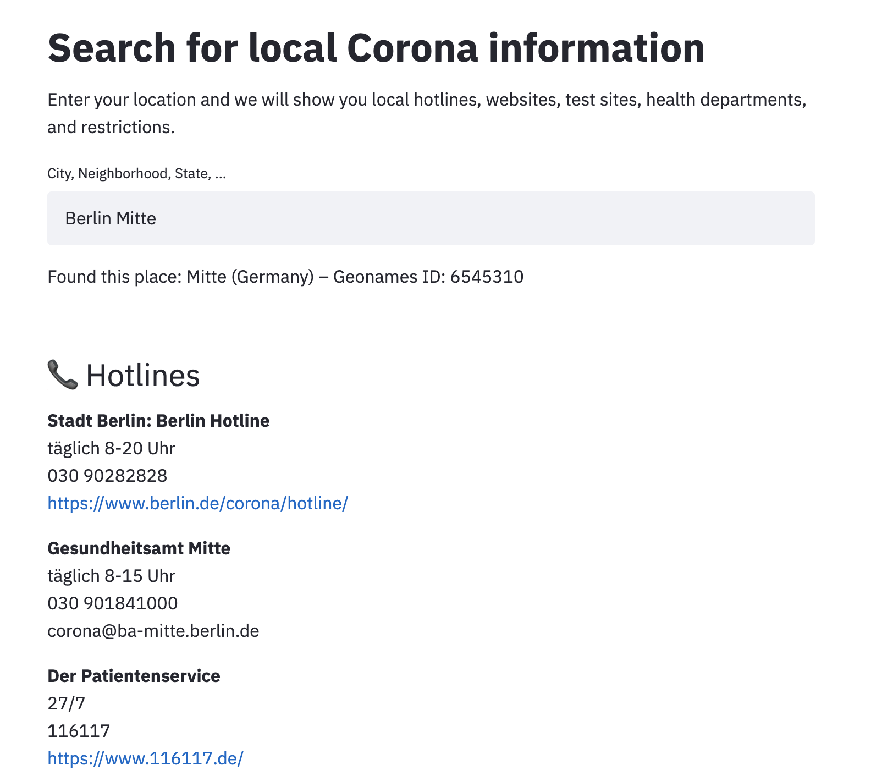
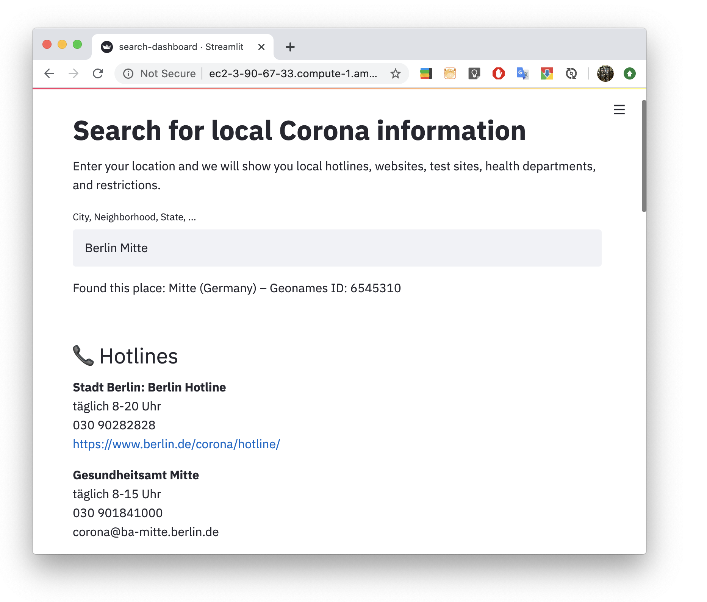
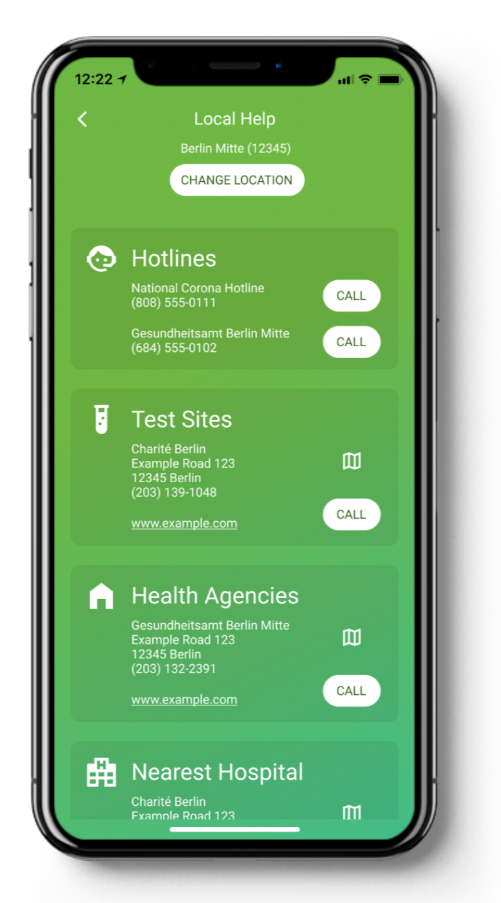

<b>API for local information and addresses on COVID-19 (hotlines, websites, test sites, health departments)</b>

    <b>
      <a href="http://ec2-3-90-67-33.compute-1.amazonaws.com:8600/">Search dashboard</a> &nbsp; • &nbsp;
      <a href="http://ec2-3-90-67-33.compute-1.amazonaws.com/docs">Swagger docs</a> &nbsp; • &nbsp;
      <a href="mailto:johannes.rieke@gmail.com">Contact</a>
    </b>

<!--

    

-->

## What is this good for?

<!---->

This API provides local information and addresses on COVID-19 for a given location (e.g. local hotlines & websites, nearby test sites, relevant health departments). It can be easily integrated into existing websites and apps, giving the user relevant information for their location. E.g., a tracing app could use this API to refer the user to their nearest test site in case of an infection risk. Features:

- **Local information** (hotlines, websites, test sites, health departments) for major German cities (more coming soon)
- **Integration in websites/apps** via REST API (Python & JS clients coming soon)
- **Built-in location search** for cities, neighborhoods, states, ...

Check out our [search dashboard](http://ec2-3-90-67-33.compute-1.amazonaws.com:8600) to get an idea of which data the API offers!

  
   

Our API in practice – web and mobile

## Usage

You can try out the API using our live deployment at: 
http://ec2-3-90-67-33.compute-1.amazonaws.com

For example, to get all local information for Berlin Mitte, go to:

    http://ec2-3-90-67-33.compute-1.amazonaws.com/all?place_name=Berlin&20Mitte

The data is returned as JSON. Note that information for hierachically higher areas 
(e.g. country-wide hotlines) are automatically returned as well. 

### Endpoints

Above, we used the `/all` endpoint to request all information from the database. You can 
also use the more specific endpoints `/hotlines`, `/websites`, `/test_sites` and 
`/health_departments`, which will only a return a subset of the data, e.g.:

    http://ec2-3-90-67-33.compute-1.amazonaws.com/hotlines?place_name=Berlin&20Mitte

### Place search

To specify the location of the query, we support two options: You can either use the 
`place_name` parameter like above (with a city, neighborhood, state, ...). Under the 
hood, this searches on geonames.org and simply uses the first result to search our 
database. To get more control over the place selection (e.g. if the place name is 
ambiguous), you can use the `/places` endpoint:

    http://ec2-3-90-67-33.compute-1.amazonaws.com/places?q=Berlin&20Mitte

This returns a list of places for your query. It uses the 
[geonames.org location search](http://www.geonames.org/export/geonames-search.html) 
with sensible defaults (e.g. search only for cities and districts) and clean 
formatting. If you found the correct place among these results, you can extract its 
`geonames_id` and pass it to the other endpoints like this:

    http://ec2-3-90-67-33.compute-1.amazonaws.com/all?geonames_id=2950159

### Docs

For more details on endpoints, query parameters, and output formats, please have a 
look at the [Swagger docs](http://ec2-3-90-67-33.compute-1.amazonaws.com/docs).

## Client libraries

Want to use the API directly in your code? We will soon publish client libraries for Python and Javascript. If you use another language, please get in touch (johannes.rieke@gmail.com). Our API is based on the OpenAPI 
standard, so we can create client libraries quickly. 

## Running the API locally

To run the API locally, clone this repo and run the following command:

    cd ./covid-local-api/app/covid_local_api
    uvicorn local_test:app --reload

The API should now be accessible at 127.0.0.1:8000. You can also deploy the API with 
docker, using the dockerfile in the repo (note that this will serve the API at port 80 instead of 8000). 

To start the [search dashboard](http://ec2-3-90-67-33.compute-1.amazonaws.com:8600), 
run:

    streamlit run search-dashboard.py

This will start the dashboard on port 8501. Note that the dockerfile automatically 
starts the dashboard along with the API (using the `prestart.sh` file; docker deployment uses port 8600 instead of 8501). 

## Data

Help us collect new data with our Google Form: 
[https://bit.ly/covid-local-form](https://bit.ly/covid-local-form)

The data for this project is stored in a 
[Google Sheet](https://docs.google.com/spreadsheets/d/1AXadba5Si7WbJkfqQ4bN67cbP93oniR-J6uN0_Av958/edit?usp=sharing) 
(note that there is one worksheet for each data type). If you think that any of the 
data is wrong, please add a comment directly to the document or write to 
johannes.rieke@gmail.com. You can also use our 
[dashboard](http://ec2-3-90-67-33.compute-1.amazonaws.com:8600) to search through the 
data. 

## Requirements

Python 3.7 and all packages in requirements.txt

